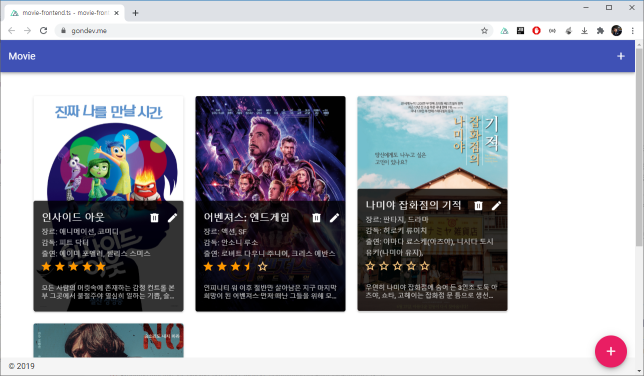

# Movie-Frontend
이 프로젝트는 개인적으로 만든 간단한 영화 정보를 입력하는 관리자 화면입니다


## 목적
이 프로젝트의 목적은 웹 서비스의 전반적인 이해를 학습 하기 위해 제작되었습니다

## 구성
이 프로젝트는 3개의 저장소로 구성되어 있습니다

* [movie-android](https://github.com/Young-Gon/movie-android): 안드로이드 클라이언트 입니다   
  코틀린으로 제작된 MVVM 학습용 앱입니다 
* [movie-backend](https://github.com/Young-Gon/movie-backend): 이 프로젝트입니다   
  안드로이드 엡에 영화 정보를 제공 합니다
* [movie-froentend](https://github.com/Young-Gon/movie-frontend): 백엔드에 영화 정보를 입력하는 화면입니다   
  Nuxt.js와 TypeScript로 제작 되어 있습니다
  
    
## 특징
1. [node.js](https://nodejs.org/ko/) 기반인 [nuxt.js](https://nuxtjs.org/) 로 제작되었습니다
2. 언어로 `javascript` 대신 `typescript`를 사용합니다
3. `typescript`를 사용하기 때문에 일반적인 nuxt.js를 사용하지 않고 [Typescript Support for Nuxt.js](https://typescript.nuxtjs.org/)프로젝트를 사용합니다 또한 [Vue Property Decorator](https://github.com/kaorun343/vue-property-decorator)를 사용하여 클레스 기반 API를 사용합니다
## Build Setup
1. [node.js](https://nodejs.org/ko/) 다운로드
2. [movie-backend](https://github.com/Young-Gon/movie-backend)를 다운 받아 서버 구동
3. 본 소스를 다운받고 다음과 같이 빌드

``` bash
# install dependencies
$ yarn install

# serve with hot reload at localhost:3000
$ yarn dev

# build for production and launch server
$ yarn build
$ yarn start

# generate static project
$ yarn generate
```
4. 백엔드 프론트 엔드가 완료 되면 http:localhost:3000으로 테스트
